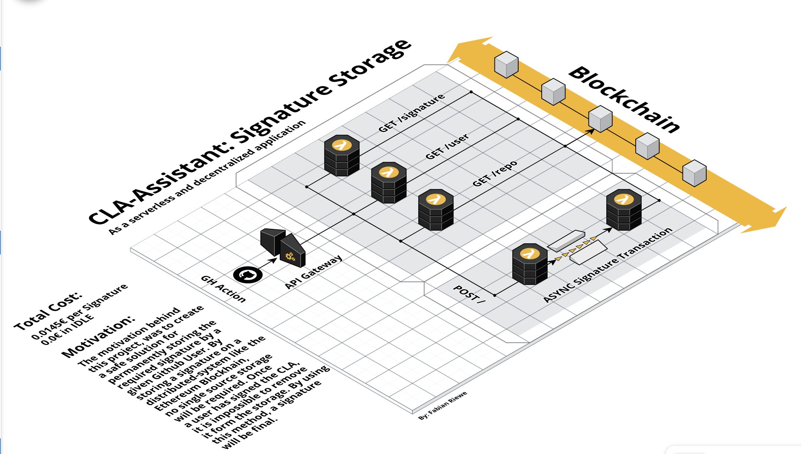

# CLA-Assistant: Signature Storage

## Overview

This project was created during the SAP Tools Hackathon 2019. By exploring the blockchain technology we were able to
create a permanent and distrubuted storage solution for digital signatures. The idea behind this, was to find a solution
which would provide a cheap and non reversible storage for a signature. Whenever a user signs a CLA in the repository, an automated process (e.g Github Action) will send the data to an endpoint, which inserts the data into a blockchain. By using the Ethereum network, data is stored world-wide and will be stored permanently. It is possible to connect the application to any other network. The API is written in node.js with express. We used the serverless framework for cost optimization. There will be a solution to run the application inside a Dockerfile. We highly recommend to use it as a serverless application.

## Architecture

